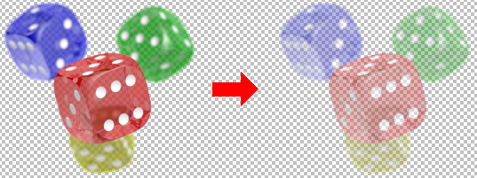
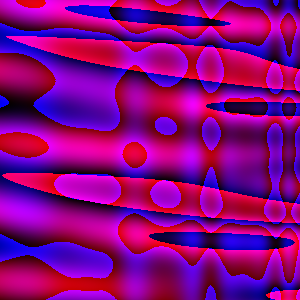
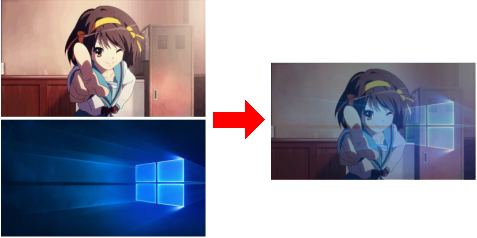

# BitmapPixels
### BitmapPixels.pas  - Lazarus module for direct access to pixels at TBitmap
---
#### Example 1 - Invert colors (read and write)

```delphi
procedure InvertColors(const Bitmap: TBitmap);
var
  Data: TBitmapData;
  X, Y: Integer;
  Pixel: TPixelRec;
begin
  Data.Map(Bitmap, TAccessMode.ReadWrite, False);// RGB access
  try
    for Y := 0 to Data.Height - 1 do
    begin
      for X := 0 to Data.Width - 1 do
      begin
        Pixel := Data.GetPixel(X, Y);
        Pixel.R := 255 - Pixel.R;
        Pixel.G := 255 - Pixel.G;
        Pixel.B := 255 - Pixel.B;
        Data.SetPixel(X, Y, Pixel);
      end;
    end;
  finally
    Data.Unmap();
  end;
end; 
```
#### Example 2 - Half bitmap transparency (read and write, alpha)

```delphi
procedure HalfAlpha(const Bitmap: TBitmap);
var
  Data: TBitmapData;
  X, Y: Integer;
  Pixel: TPixelRec;
begin
  Data.Map(Bitmap, TAccessMode.ReadWrite, True);// ARGB access
  try
    for Y := 0 to Data.Height - 1 do
    begin
      for X := 0 to Data.Width - 1 do
      begin
        Pixel := Data.GetPixel(X, Y);
        Pixel.A := Pixel.A div 2;
        Data.SetPixel(X, Y, Pixel);
      end;
    end;
  finally
    Data.Unmap();
  end;
end; 
```
#### Example 3 - Make a plasm effect on bitmap (write only)

```delphi
function MakePlasm(): TBitmap;
var
  Data: TBitmapData;
  X, Y: Integer;
  Pixel: TPixelRec;
begin
  Result := TBitmap.Create();
  Result.SetSize(300, 300);

  Data.Map(Result, TAccessMode.Write, False);
  try
    for Y := 0 to Data.Height - 1 do
    begin
      for X := 0 to Data.Width - 1 do
      begin
        Pixel.R := Byte(Trunc(
          100 + 100 * (Sin(X * Cos(Y * 0.049) * 0.01) + Cos(X * 0.0123 - Y * 0.09))));
        Pixel.G := 0;
        Pixel.B := Byte(Trunc(
          Pixel.R + 100 * (Sin(X * Cos(X * 0.039) * 0.022) + Sin(X * 0.01 - Y * 0.029))));
        Data.SetPixel(X, Y, Pixel);
      end;
    end;
  finally
    Data.Unmap();
  end;
end;
```
#### Example 4 - Mix two bitmaps to one bitmap (read only, write only)

```delphi
function Mix(const A, B: TBitmap): TBitmap;
  function Min(A, B: Integer): Integer;
  begin
    if A < B then Exit(A) else Exit(B);
  end;
var
  DataA, DataB, DataResult: TBitmapData;
  X, Y: Integer;
  PixelA, PixelB, PixelResult: TPixelRec;
begin
  Result := TBitmap.Create();
  Result.SetSize(Min(A.Width, B.Width), Min(A.Height, B.Height));
  // this needed for correct Unmap() on exception
  DataA.Init();
  DataB.Init();
  DataResult.Init();
  try
    DataA.Map(A, TAccessMode.Read, False);
    DataB.Map(B, TAccessMode.Read, False);
    DataResult.Map(Result, TAccessMode.Write, False);
    for Y := 0 to DataResult.Height - 1 do
    begin
      for X := 0 to DataResult.Width - 1 do
      begin
        PixelA := DataA.Pixels[X, Y];
        PixelB := DataB.Pixels[X, Y];
        PixelResult.R := (PixelA.R + PixelB.R) div 2;
        PixelResult.G := (PixelA.G + PixelB.G) div 2;
        PixelResult.B := (PixelA.B + PixelB.B) div 2;
        DataResult[X, Y] := PixelResult;
      end;
    end;
  finally
    DataA.Unmap();
    DataB.Unmap();
    DataResult.Unmap();
  end;
end;
```
